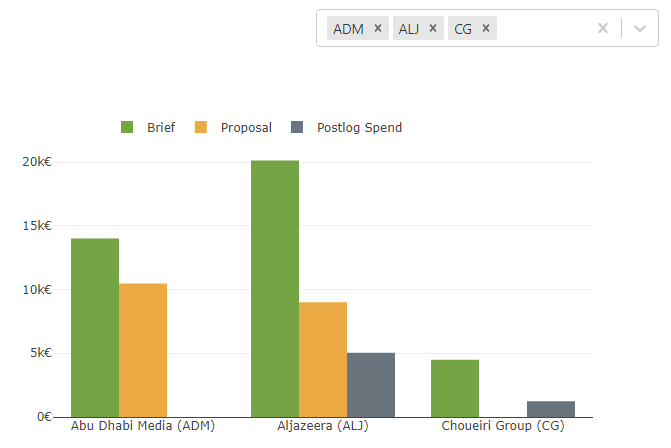

## React Plotly chart

Demo of a React component showing a chart; see it live at http://reactplotly.jordisan.net/

Based on
- React Plotly: https://plot.ly/javascript/react/
- Minimal React setup: https://github.com/rwieruch/minimal-react-webpack-babel-setup

# Installation

1. `npm install`
2. `npm start`
3. visit `http://localhost:8080/`

(or 2. `npm run build` if not using Webpack)
